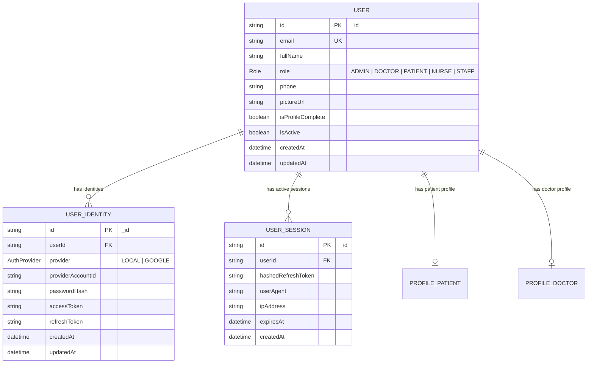
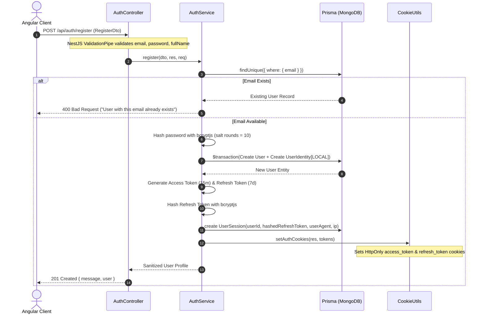
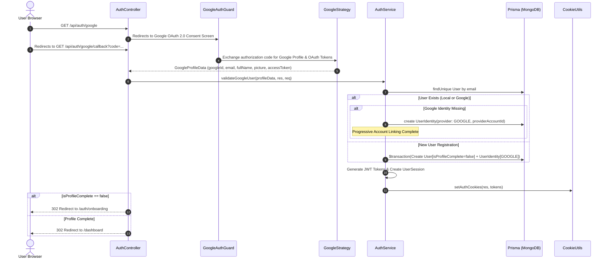
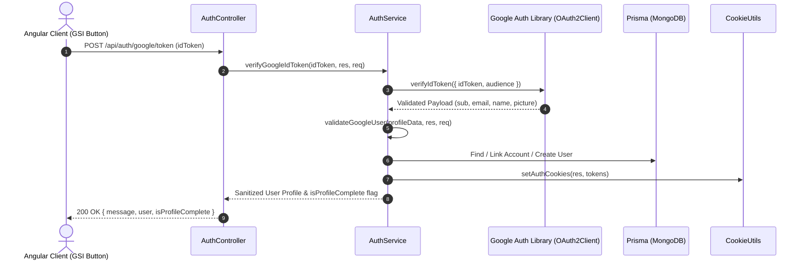
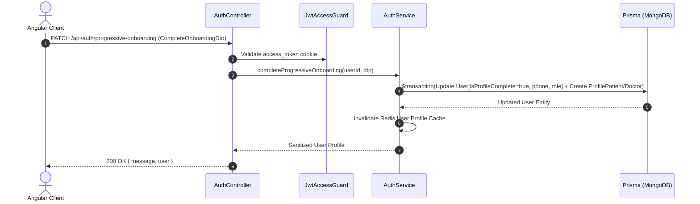
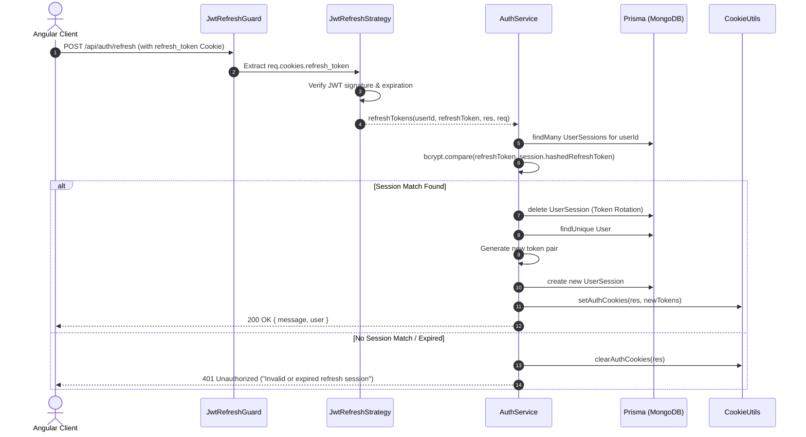

# Comprehensive Authentication Architecture & Lifecycle Documentation

This document provides an exhaustive reference for the authentication system implemented in `apps/api` and consumed across `@hospital-services/api-client`, `apps/hospital-admin`, and `apps/patient-web`. It covers security architecture, database schema, Progressive Google OAuth 2.0 integration, account linking, progressive profile onboarding, sequence diagrams, and frontend integration.

---

## 1. Architectural Principles & Security Design

### A. HTTP-Only Cookie Storage (XSS Protection)
Storing JWTs in `localStorage` or `sessionStorage` exposes applications to **Cross-Site Scripting (XSS)** attacks, where malicious scripts can read tokens and impersonate users. 

This architecture enforces **HTTP-Only, SameSite, Path-Scoped Cookies**:
- **`access_token` Cookie**:
  - `HttpOnly: true` (Inaccessible to JavaScript)
  - `SameSite: 'lax'` (CSRF mitigation)
  - `Path: '/'` (Available for all API requests)
  - `Max-Age: 15 minutes` (Short-lived token window)
- **`refresh_token` Cookie**:
  - `HttpOnly: true`
  - `SameSite: 'lax'`
  - `Path: '/api/auth/refresh'` (Restricted scope; sent *only* when hitting the refresh endpoint)
  - `Max-Age: 7 days` (Long-lived session window)

### B. Decoupled Base User & Auth Strategy Discriminator (`UserIdentity`)
Rather than storing password hashes or OAuth provider fields directly on the core `User` model, entity management is decoupled from authentication mechanisms:
- **`User` Entity**: Core identity (`id`, `email`, `fullName`, `role`, `phone`, `pictureUrl`, `isProfileComplete`, `isActive`).
- **`UserIdentity` Entity**: Auth provider bindings (`userId`, `provider` enum (`LOCAL`, `GOOGLE`), `providerAccountId`, `passwordHash`, `accessToken`, `refreshToken`).
- **Benefits**:
  1. **Progressive Account Linking**: Users can register with Email/Password (`provider: LOCAL`) and later sign in with Google (`provider: GOOGLE`) using the same email. The system automatically links the Google identity to the existing base user.
  2. **Progressive OAuth Scope Storage**: OAuth access tokens and refresh tokens received during Google consent are stored on `UserIdentity`, allowing backend workers (e.g., BullMQ) to perform feature-level integrations (such as Google Calendar sync) on behalf of the user.

### C. Progressive OAuth & Profile Onboarding
- **Low-Friction Initial Sign In**: Initial Google OAuth requests standard identity scopes (`openid`, `email`, `profile`).
- **Progressive Onboarding**: If a user logs in via Google for the first time and lacks required role/phone details, `isProfileComplete` is set to `false`. The frontend prompts the user with a progressive onboarding step (`/auth/onboarding`) to complete profile metadata without blocking initial authentication.
- **Dual Flow Support**: Supports both Server-Side Passport OAuth 2.0 (`/api/auth/google`) and Client-Side Google Identity Services (GIS) ID Token verification (`/api/auth/google/token`).

### D. Multi-Device Session Management & Token Rotation (`UserSession`)
Refresh tokens are hashed using `bcryptjs` and stored in the `UserSession` MongoDB table:
- **Token Rotation**: Every time a refresh token is used at `/api/auth/refresh`, the old session is deleted and a fresh session is issued with a new refresh token.
- **Session Revocation**: Logging out deletes the session from the database, instantly invalidating the refresh token even if someone possesses the raw cookie.
- **Multi-Device Support**: Users can be logged into multiple browsers/devices simultaneously without invalidating each other's sessions.

---

## 2. Database Schema (Prisma & MongoDB)



---

## 3. Directory Structure & File Map

```
apps/api/src/app/
├── modules/
│   ├── auth/
│   │   ├── decorators/
│   │   │   ├── current-user.decorator.ts    # Parameter decorator to extract req.user
│   │   │   └── roles.decorator.ts           # Metadata decorator to specify required roles
│   │   ├── dto/
│   │   │   ├── auth-response.dto.ts         # UserProfileDto and AuthResponseDto
│   │   │   ├── complete-onboarding.dto.ts   # Post-OAuth profile completion schema
│   │   │   ├── google-auth.dto.ts           # Google ID Token schema
│   │   │   ├── login.dto.ts                 # Login validation schema
│   │   │   └── register.dto.ts              # Registration validation schema
│   │   ├── guards/
│   │   │   ├── google-auth.guard.ts         # Passport Google Strategy route guard
│   │   │   ├── jwt-access.guard.ts          # Protects routes requiring valid access token
│   │   │   ├── jwt-refresh.guard.ts         # Protects refresh route requiring valid refresh token
│   │   │   └── roles.guard.ts               # Enforces Role-Based Access Control (RBAC)
│   │   ├── strategies/
│   │   │   ├── google.strategy.ts           # Passport Google OAuth 2.0 Strategy
│   │   │   ├── jwt-access.strategy.ts       # Extracts & validates access_token cookie
│   │   │   └── jwt-refresh.strategy.ts      # Extracts & validates refresh_token cookie
│   │   ├── utils/
│   │   │   └── cookie.utils.ts              # setAuthCookies() & clearAuthCookies() helpers
│   │   ├── auth.controller.ts               # Auth REST endpoints (Google OAuth, login, register, refresh)
│   │   ├── auth.module.ts                   # Auth feature module configuration
│   │   └── auth.service.ts                  # Auth business logic (Google validation, account linking, JWTs)
│   ├── users/
│   │   ├── users.controller.ts              # Profile retrieval and update endpoints
│   │   ├── users.module.ts                  # Users feature module configuration
│   │   └── users.service.ts                 # User profile query service
│   └── prisma/
│       ├── prisma.module.ts                 # Database access module
│       └── prisma.service.ts                # Prisma singleton client service
└── app.module.ts                            # Main application root module
```

---

## 4. End-to-End Flow Lifecycles & Sequence Diagrams

### Flow 1: Registration (`POST /api/auth/register`)



---

### Flow 2: Progressive Google OAuth Login & Account Linking (`GET /api/auth/google/callback`)



---

### Flow 3: Client-Side Google ID Token Verification (`POST /api/auth/google/token`)



---

### Flow 4: Progressive Profile Onboarding (`PATCH /api/auth/progressive-onboarding`)



---

### Flow 5: Token Refresh & Rotation (`POST /api/auth/refresh`)



---

## 5. Frontend Angular Integration (`hospital-admin` & `patient-web`)

All frontend applications consume `AuthApiService` directly from `@hospital-services/api-client`.

### Auth API Service Methods (`AuthApiService`):
- `login(credentials: LoginCredentials)`: Standard email/password login.
- `register(credentials: RegisterCredentials)`: Standard email/password registration.
- `loginWithGoogleRedirect()`: Initiates browser redirect to `/api/auth/google`.
- `loginWithGoogleToken(credentials: GoogleTokenCredentials)`: Verifies client-side Google GSI ID Token.
- `completeOnboarding(credentials: CompleteOnboardingCredentials)`: Sends profile onboarding metadata.
- `fetchCurrentUser()`: Auto-restores user session on page load via HTTP-Only cookie.
- `logout()`: Clears HTTP-Only cookies and resets Angular user signals (`currentUser`, `isAuthenticated`, `isProfileComplete`).

### Angular `authInterceptor` Configuration (`withCredentials: true`):
[`apps/hospital-admin/src/app/core/interceptors/auth.interceptor.ts`](file:///Users/gparthasrikar/Documents/projects/hospital-services/hospital-services/apps/hospital-admin/src/app/core/interceptors/auth.interceptor.ts)
```typescript
import { HttpInterceptorFn } from '@angular/common/http';

export const authInterceptor: HttpInterceptorFn = (req, next) => {
  // Always include credentials (HTTP-Only Cookies) on outgoing API requests
  const authReq = req.clone({
    withCredentials: true,
  });

  return next(authReq);
};
```
