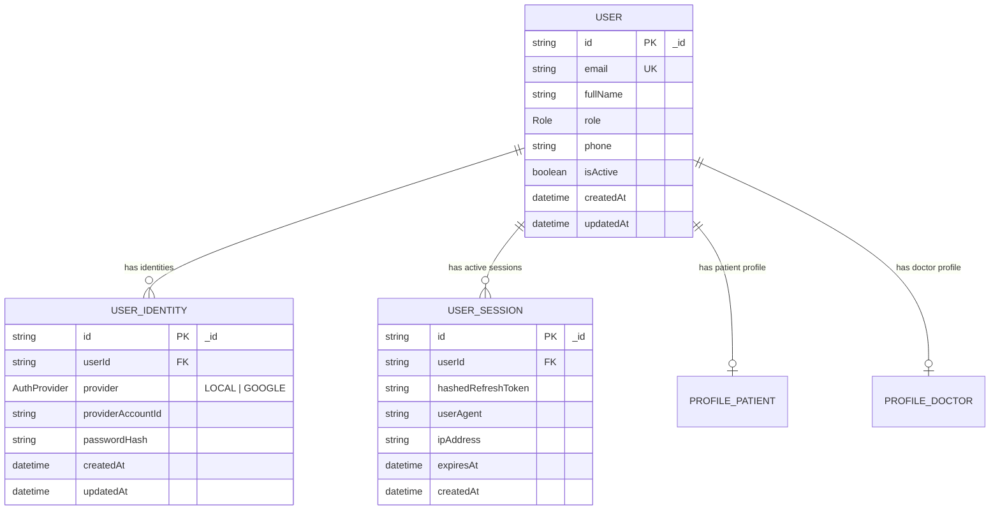
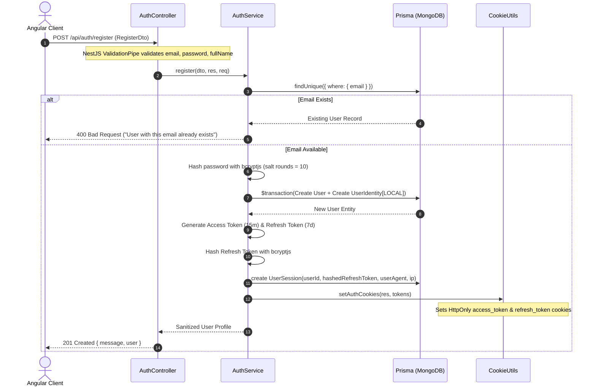
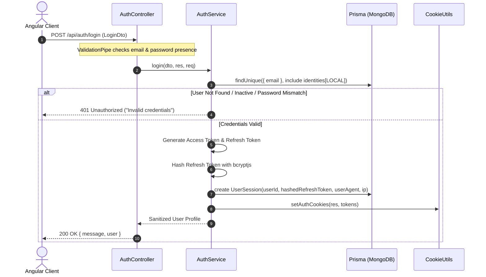
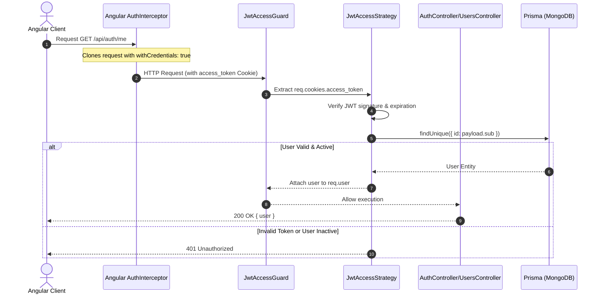
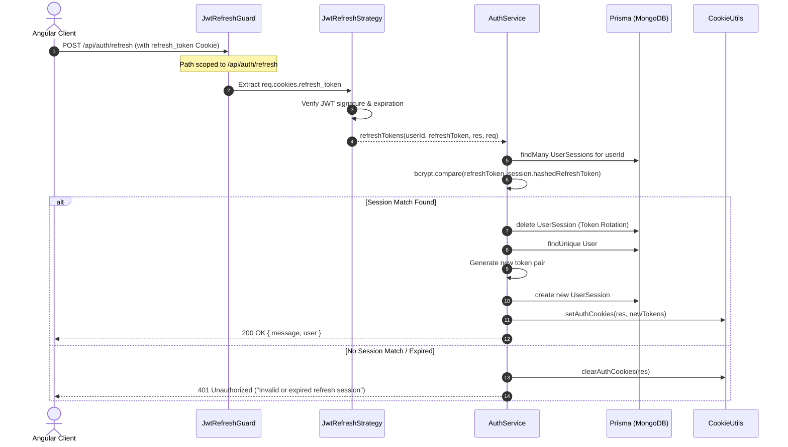
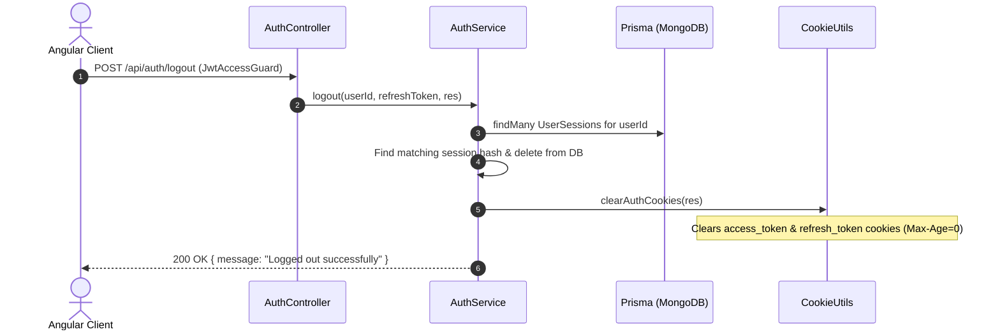

# Comprehensive Authentication Architecture & Lifecycle Documentation

This document provides an exhaustive reference for the authentication system implemented in `apps/api`. It covers the design philosophy, database schema, security mechanisms, file responsibilities, end-to-end lifecycle flows, Mermaid sequence diagrams, and frontend integration.

---

## 1. Architectural Principles & Security Design

### A. HTTP-Only Cookie Storage (XSS Protection)
Storing JWTs in `localStorage` or `sessionStorage` exposes applications to **Cross-Site Scripting (XSS)** attacks, where malicious scripts can read tokens and impersonate users. 

This architecture enforces **HTTP-Only, SameSite, Path-Scoped Cookies**:
- **`access_token` Cookie**:
  - `HttpOnly: true` (Inaccessible to JavaScript)
  - `SameSite: 'lax'` (CSRF mitigation)
  - `Path: '/'` (Available for all API requests)
  - `Max-Age: 15 minutes` (Short-lived token window)
- **`refresh_token` Cookie**:
  - `HttpOnly: true`
  - `SameSite: 'lax'`
  - `Path: '/api/auth/refresh'` (Restricted scope; sent *only* when hitting the refresh endpoint)
  - `Max-Age: 7 days` (Long-lived session window)

### B. Decoupled Base User & Auth Strategy Discriminator (`UserIdentity`)
Rather than storing password hashes or OAuth provider fields directly on the core `User` model, entity management is decoupled from authentication mechanisms:
- **`User` Entity**: Core identity (`id`, `email`, `fullName`, `role`, `phone`, `isActive`).
- **`UserIdentity` Entity**: Auth provider bindings (`userId`, `provider` enum (`LOCAL`, `GOOGLE`), `providerAccountId`, `passwordHash`).
- **Benefits**:
  1. Users can register with Email/Password (`provider: LOCAL`) and later link their Google account (`provider: GOOGLE`) to the exact same base user.
  2. Adding new OAuth providers requires zero schema changes to core user tables.

### C. Multi-Device Session Management & Token Rotation (`UserSession`)
Refresh tokens are hashed using `bcryptjs` and stored in the `UserSession` MongoDB table:
- **Token Rotation**: Every time a refresh token is used at `/api/auth/refresh`, the old session is deleted and a fresh session is issued with a new refresh token.
- **Session Revocation**: Logging out deletes the session from the database, instantly invalidating the refresh token even if someone possesses the raw cookie.
- **Multi-Device Support**: Users can be logged into multiple browsers/devices simultaneously without invalidating each other's sessions.

---

## 2. Database Schema (Prisma & MongoDB)



---

## 3. Directory Structure & File Map

```
apps/api/src/app/
├── modules/
│   ├── auth/
│   │   ├── decorators/
│   │   │   ├── current-user.decorator.ts    # Custom parameter decorator to extract req.user
│   │   │   └── roles.decorator.ts           # Metadata decorator to specify required roles
│   │   ├── dto/
│   │   │   ├── auth-response.dto.ts         # UserProfileDto and AuthResponseDto
│   │   │   ├── login.dto.ts                 # Login validation schema
│   │   │   └── register.dto.ts              # Registration validation schema
│   │   ├── guards/
│   │   │   ├── jwt-access.guard.ts          # Protects routes requiring valid access token
│   │   │   ├── jwt-refresh.guard.ts         # Protects refresh route requiring valid refresh token
│   │   │   └── roles.guard.ts               # Enforces Role-Based Access Control (RBAC)
│   │   ├── strategies/
│   │   │   ├── google.strategy.ts           # Prepared Google OAuth 2.0 configuration stub
│   │   │   ├── jwt-access.strategy.ts       # Extracts & validates access_token cookie
│   │   │   └── jwt-refresh.strategy.ts      # Extracts & validates refresh_token cookie
│   │   ├── utils/
│   │   │   └── cookie.utils.ts              # setAuthCookies() & clearAuthCookies() helpers
│   │   ├── auth.controller.ts               # Auth REST endpoints
│   │   ├── auth.module.ts                   # Auth feature module configuration
│   │   └── auth.service.ts                  # Auth business logic (hashing, sessions, JWTs)
│   ├── users/
│   │   ├── users.controller.ts              # Profile retrieval and update endpoints
│   │   ├── users.module.ts                 # Users feature module configuration
│   │   └── users.service.ts                 # User profile query service
│   └── prisma/
│       ├── prisma.module.ts                 # Database access module
│       └── prisma.service.ts                # Prisma singleton client service
└── app.module.ts                        # Main application root module
```

---

## 4. End-to-End Flow Lifecycles & Sequence Diagrams

### Flow 1: Registration (`POST /api/auth/register`)



---

### Flow 2: Login (`POST /api/auth/login`)



---

### Flow 3: Accessing Protected Endpoints (`GET /api/auth/me`, `GET /api/users/profile`)



---

### Flow 4: Token Refresh & Rotation (`POST /api/auth/refresh`)



---

### Flow 5: Logout (`POST /api/auth/logout`)



---

## 5. Frontend Angular Integration (`hospital-admin` & `patient-web`)

Because tokens are managed via HTTP-Only cookies, frontends do **not** read or store raw token strings in `localStorage`.

### Angular `authInterceptor` Configuration:
[`apps/hospital-admin/src/app/core/interceptors/auth.interceptor.ts`](file:///Users/gparthasrikar/Documents/projects/hospital-services/hospital-services/apps/hospital-admin/src/app/core/interceptors/auth.interceptor.ts)
```typescript
import { HttpInterceptorFn } from '@angular/common/http';

export const authInterceptor: HttpInterceptorFn = (req, next) => {
  // Always include credentials (HTTP-Only Cookies) on outgoing API requests
  const authReq = req.clone({
    withCredentials: true,
  });

  return next(authReq);
};
```

### NestJS CORS Configuration:
[`apps/api/src/main.ts`](file:///Users/gparthasrikar/Documents/projects/hospital-services/hospital-services/apps/api/src/main.ts)
```typescript
app.enableCors({
  origin: [
    'http://localhost:4200', // patient-web
    'http://localhost:4201', // hospital-admin
    'http://localhost:3000',
  ],
  credentials: true, // Required for cross-site cookie transmission
});
```

---

## 6. Future Extension Roadmap: Google OAuth 2.0 Integration

To activate Google OAuth 2.0 in the future:

1. **Install Strategy Package**:
   ```bash
   pnpm add passport-google-oauth20 && pnpm add -D @types/passport-google-oauth20
   ```
2. **Environment Variables**:
   Update `.env` with actual credentials from Google Cloud Console:
   ```env
   GOOGLE_CLIENT_ID="your-google-client-id"
   GOOGLE_CLIENT_SECRET="your-google-client-secret"
   GOOGLE_CALLBACK_URL="http://localhost:3000/api/auth/google/callback"
   ```
3. **Activate `GoogleStrategy`**:
   Extend Passport `GoogleStrategy` in `google.strategy.ts`. When a user authenticates via Google:
   - Extract `profile.id` and `profile.emails[0].value`.
   - Query `UserIdentity` where `provider = GOOGLE` and `providerAccountId = profile.id`.
   - If not found, create base `User` record and link `UserIdentity(provider: GOOGLE, providerAccountId: profile.id)`.
   - Issue tokens, create `UserSession`, and attach HTTP-Only cookies.
