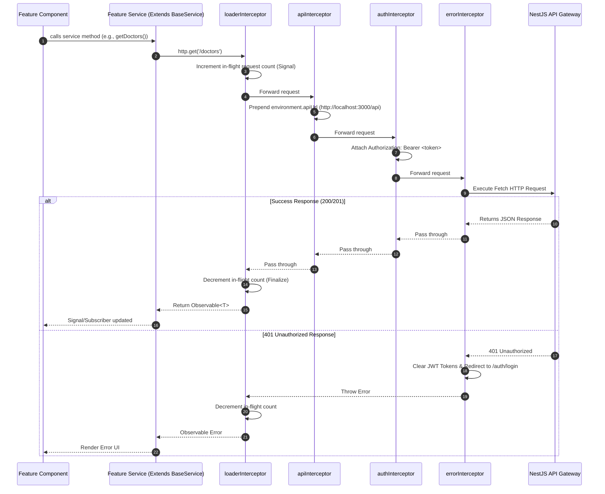

# HTTP Client & API Integration Architecture

This document describes the HTTP Client architecture, interceptor pipeline, state management, and service conventions implemented for Angular applications in this workspace (`hospital-admin`, `patient-web`).

---

## 1. Architecture Overview



---

## 2. Core Components

### A. Base Service (`BaseService`)
Location: [`apps/hospital-admin/src/app/core/services/base.service.ts`](file:///Users/gparthasrikar/Documents/projects/hospital-services/hospital-services/apps/hospital-admin/src/app/core/services/base.service.ts)

All feature services inherit from `BaseService` instead of injecting raw `HttpClient`. It centralizes error handling and exposes typed helpers:

```typescript
@Injectable({ providedIn: 'root' })
export class BaseService {
  protected http = inject(HttpClient);

  protected get<T>(url: string, options?: HttpOptions): Observable<T>;
  protected post<T>(url: string, body: unknown, options?: HttpOptions): Observable<T>;
  protected put<T>(url: string, body: unknown, options?: HttpOptions): Observable<T>;
  protected patch<T>(url: string, body: unknown, options?: HttpOptions): Observable<T>;
  protected delete<T>(url: string, options?: HttpOptions): Observable<T>;
}
```

### B. Standard API Response Contract (`ApiResponse<T>`)
Location: [`apps/hospital-admin/src/app/core/models/api-response.interface.ts`](file:///Users/gparthasrikar/Documents/projects/hospital-services/hospital-services/apps/hospital-admin/src/app/core/models/api-response.interface.ts)

```typescript
export interface ApiResponse<T> {
  success: boolean;
  data: T;
  message?: string;
  statusCode?: number;
  timestamp?: string;
}
```

### C. Global Loader State (`GlobalLoaderService`)
Location: [`apps/hospital-admin/src/app/core/services/loader.service.ts`](file:///Users/gparthasrikar/Documents/projects/hospital-services/hospital-services/apps/hospital-admin/src/app/core/services/loader.service.ts)

Tracks active requests reactively using Angular Signals:

```typescript
@Injectable({ providedIn: 'root' })
export class GlobalLoaderService {
  private inFlightRequests = signal(0);
  
  // Public reactive computed state for progress bars/spinners
  isLoading = computed(() => this.inFlightRequests() > 0);

  show(): void;
  hide(): void;
}
```

### D. Token Security Service (`TokenService`)
Location: [`apps/hospital-admin/src/app/core/services/token.service.ts`](file:///Users/gparthasrikar/Documents/projects/hospital-services/hospital-services/apps/hospital-admin/src/app/core/services/token.service.ts)

Encapsulates reading, writing, and clearing JWT tokens in `localStorage`.

---

## 3. Interceptor Pipeline

Registered in [`apps/hospital-admin/src/app/app.config.ts`](file:///Users/gparthasrikar/Documents/projects/hospital-services/hospital-services/apps/hospital-admin/src/app/app.config.ts):

```typescript
provideHttpClient(
  withFetch(),
  withInterceptors([
    loaderInterceptor,
    apiInterceptor,
    authInterceptor,
    errorInterceptor,
  ])
)
```

| Interceptor | Responsibility |
| :--- | :--- |
| **`loaderInterceptor`** | Automatically increments/decrements `GlobalLoaderService` count. Skips requests containing `X-Skip-Loader` header. |
| **`apiInterceptor`** | Prepend `environment.apiUrl` (`http://localhost:3000/api`) to relative endpoint paths. |
| **`authInterceptor`** | Injects `Authorization: Bearer <accessToken>` header if token exists. |
| **`errorInterceptor`** | Catches `401 Unauthorized` responses, clears tokens, and redirects user to `/auth/login`. |

---

## 4. How to Create a New Feature Service

To add a new API feature service (e.g. `DoctorService`):

```typescript
import { Injectable } from '@angular/core';
import { Observable } from 'rxjs';
import { BaseService } from '../services/base.service';

export interface Doctor {
  id: string;
  name: string;
  specialty: string;
}

@Injectable({ providedIn: 'root' })
export class DoctorService extends BaseService {
  getDoctors(): Observable<Doctor[]> {
    return this.get<Doctor[]>('/doctors');
  }

  createDoctor(payload: Partial<Doctor>): Observable<Doctor> {
    return this.post<Doctor>('/doctors', payload);
  }

  // Silent polling request (skips global spinner)
  pollDoctorStatus(id: string): Observable<Doctor> {
    return this.get<Doctor>(`/doctors/${id}`, {
      headers: { 'X-Skip-Loader': 'true' },
    });
  }
}
```

---

## 5. Usage in Components

```typescript
@Component({
  selector: 'app-doctors-page',
  standalone: true,
  template: `
    @if (loader.isLoading()) {
      <div class="spinner">Loading...</div>
    }

    @for (doctor of doctors(); track doctor.id) {
      <div>{{ doctor.name }} - {{ doctor.specialty }}</div>
    }
  `
})
export class DoctorsPageComponent implements OnInit {
  private doctorService = inject(DoctorService);
  public loader = inject(GlobalLoaderService);

  doctors = signal<Doctor[]>([]);

  ngOnInit(): void {
    this.doctorService.getDoctors().subscribe((data) => {
      this.doctors.set(data);
    });
  }
}
```
